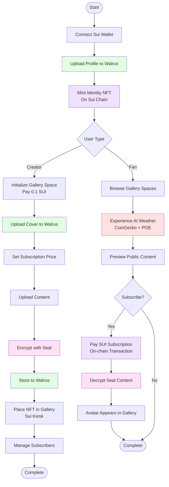

# Atrium 🏛️


> **Web3 creator platform with AI-powered dynamic 3D spaces**

**Atrium** is a decentralized creator platform where creators can publish essays and videos within their spaces. What makes it unique is an **AI Weather System** that transforms each space’s atmosphere based on crypto market data, real-world time, and subscriber count.

>*AI lowers the barrier to creation, but we believe the true value lies in connection and co‑creation—building community bonds through interactive objects to create meaningful collaborative experiences.*

---

## 🌟 Key Features

- 🌤️ **Co-created Spaces** - 3D spaces dynamically shaped by subscriber count, market prices, and real-world time
- 🔗 **Community Connections** - Display subscriber 3D avatars within spaces, building meaningful bonds through visual community presence
- 📝 **Creator Media** - Publish essays, videos, and encrypted content for subscribers
- 🎨 **NFT & Merch Display** - Purchasable NFT objects directly within spaces, built on Sui Kiosk standard, creating monetization channels for creators
- 💎 **Subscription Economy** - Direct creator payments with on-chain verification

---

## Tech Stack

| Layer | Technology | Purpose |
|-------|-----------|---------|
| **Blockchain** | Sui | Identity, spaces, subscriptions |
| **Storage** | Walrus | Decentralized storage for media |
| **Encryption** | Seal | Content protection |
| **3D Rendering** | Three.js | WebGL-based 3D scenes |
| **Frontend** | Next.js 14 | React framework |
| **Styling** | Tailwind CSS | Utility-first CSS |
| **DATA x AI** | CoinGecko + POE | Market-driven weather |

---

## 🚀 Quick Start

### Prerequisites

```bash
Node.js 18+
Sui Wallet (browser extension)
```

### Installation

```bash
# Clone repository
git clone https://github.com/yourusername/atrium.git
cd atrium/frontend

# Install dependencies
npm install

# Configure environment
cp .env.example .env.local
```

Edit `.env.local`:

```env
NEXT_PUBLIC_SUI_NETWORK=testnet
NEXT_PUBLIC_PACKAGE_ID=0x...
POE_API_KEY=your_poe_api_key
```
---

## 📁 Project Structure

```
atrium/
├── contract/                          # Sui Move contracts
│   └── sources/
│       ├── identity.move              # User identity NFTs (Sui)
│       ├── space.move                 # Gallery spaces (Sui Kiosk)
│       └── subscription.move          # Subscription system (Sui)
│
├── frontend/
│   ├── app/api/ai-weather/            # AI Weather API endpoint
│   │   └── route.ts
│   │
│   ├── services/                      # Core services
│   │   ├── aiWeatherClient.ts         # AI Weather client
│   │   ├── chainDataApi.ts            # CoinGecko market data
│   │   ├── poeApi.ts                  # POE AI integration
│   │   ├── timeFactors.ts             # Market time analysis
│   │   ├── walrusApi.ts               # Walrus storage service
│   │   └── sealContent.ts             # Seal encryption service
│   │
│   ├── config/
│   │   ├── sui.ts                     # Sui network config
│   │   ├── walrus.ts                  # Walrus endpoints
│   │   ├── seal.ts                    # Seal key servers
│   │   └── aiPrompts.ts               # AI weather prompts
│   │
│   ├── hooks/
│   │   └── useAIWeather.ts            # AI Weather state hook
│   │
│   ├── components/3d/
│   │   └── AIWeatherIndicator.tsx     # Weather UI component
│   │
│   └── utils/
│       ├── kioskTransactions.ts       # Sui Kiosk transactions
│       └── transactions.ts            # Sui transaction helpers
│
└── docs/
    └── AI_WEATHER_SYSTEM.md           # AI Weather system docs
```

---

## 🎮 User Flows




